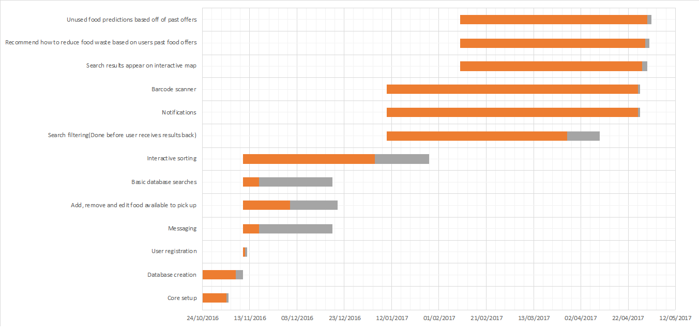

# Introduction

Every year in the UK, we throw away 7 million tonnes of food – half of which is perfectly edible. Leveraging such an enormous unused food supply would not only be of great social benefit to those struggling to feed themselves, but also of economic benefit to the typical household. It is estimated that the average family loses £700 a year due directly to food waste. [[1]](http://www.lovefoodhatewaste.com/node/2472)

The main cause of food waste is preparing a larger meal than was needed.  Especially when feeling hungry, having ‘eyes bigger than your stomach’ is a common mistake in the kitchen. The remaining food is quite literally good enough to eat, only lacking someone to do so. People would be quite happy to give their food away, if they could only find someone that would take it.

Our proposed project – Dinno, is a mobile-friendly website focussed on tackling the ongoing issue of food waste in the UK. Through Dinno, users can advertise their unwanted food and with the integrated messaging system, get in touch with likeminded individuals. Users will be able to quickly and comprehensively search for meals or ingredients in their local area and arrange a suitable time for collection.

In much the same way that social networks have made connecting with friends an effortless task, the power of the internet could easily be used to connect people with food to those that need it. Using Dinno, people can quickly see an overview of available donations in the area and if any look particularly appealing, contact the donor to claim their food. What was once only achieved by a few dedicated charities could easily be accomplished by the everyday man with the help of a simple, streamlined website.

# Project Scope

## Purpose of Software Project

The purpose of this project is to provide an internet based solution that allows users to give away unwanted food items to others. We aim to achieve this by making the human interaction part of the system as simple as possible without imposing restrictions on how complex the features could be. Because it is an internet based solution, it can provide affordances that only this type of medium can provide, such as the ability to scale the layout of the program to different devices efficently. Due to the ubiquity of internet browsers, it makes it viable to reach a wide audience.

## Benefits

There are many benefits that this software project will provide, which are not limited to:

- The project will allow users to give away unwanted food items. Food is an abundance and, as mentioned in the introduction a lot of edible food is discarded. Our SaaS can help ensure that food can go to people who need it.

- The project will allow users to advertise unwanted food items. Many people find it inconvenient to go out of their way in making sure that their surplus food can be put into good use.

- The project will help spread goodwill among users. Allowing users the opportunity to give away allows them to see first hand where their food is going, which helps in making them feel that they are helping out others.

- Reduce household spending bills. Due to the nature of this software, users will intuitively spend less on groceries.

## Project Boundaries

<!-- read through -->

For the moment we will not be producing a native mobile application from scratch, as our group collectively have little to zero experience in this particular environment, adding to the timespan needed to produced such a program. Additionally, the performance that this app will provide as opposed to a web-container style app isn't enough to justify the program to be made.

## Product Vision

- User has food he is willing to give away
- User goes to our website
- User scans or puts in details of the food, alongside an assisting photo
- Another user goes to site
- Another user searches for an item they like
- User requests item.
- Both agree to meet up and food items.
- Both users rate each other's experience.

## User Base

- Users short on food resources
- Users wishing to give away food
- Users wishing to find free food
- Users with an already full supply of groceries.
- Users short on food
- Anyone >=18 years old with knowledge of the internet

# Domain Analysis

## Background

There are charities which supply a food sharing experience at events, by catering for events using only spare food. These act usually as a small group of committed individuals who collect the food, prepare it and then give it out whilst collecting some donations. This method means that there is a quality control at the charity collection level, meaning that the users of the prepared food have a greater confidence in the food. Not having this and having a more peer to peer approach to food sharing will get rid of this confidence - this is a problem to tackle.

An example of this method of food sharing is “REfUSE”, a pop up cafe in Durham. They run on a “pay as you feel” basis in order for the cafe to keep running. Another way is to have a “community fridge” where a village has a shop-like place which is stocked and taken from by villagers for free.

In both respects, and any other future respects, there is a system which assists those with excess food and a willingness to support charity to those in need of food. It is key to link these two groups in an effective way.
In regards to security in these systems, there is little. Personal details which are commonly needed such as email addresses and location data are needed to be protected, but despite no sensitive information being held, security is still high priority. Other information in the system is on the food which has to be open to all users for it to work successfully.

## Existing Applications

There is a current system in the form of an app called “OLIO - Food Sharing Revolution”. The app seems to have, overall, positive reviews. The one big downside to it is that food is not the only thing to be advertised on the app instead it is swamped with other non-edible items. This should be solved by having approved items only on the marketplace for users, either by a selected admin or by some automated method.

Easy to set up an account either through Facebook or email. It is easy to locate the food and see who has posted it, also it shows how long it has been posted for and allows for a short description.

We have found it to be quite busy looking with a long list of items sorted by distance to the user. There are no other options for ordering the list or searching - only a “Just Gone” section of the most recently posted food in an almost pointless nation level radius. The big downside is that it has to be popular to work, no one wants to travel very far to get an apple.

# Roles

## Basic Deliverables
| ID | Deliverable         | Assigned to   |
| --- | ----------------- | ------------ |
| B1 | Core setup          | @tnguyen      |
| B2 | Database creation   | @jgbremner      |
| B3 | User registration   | @jj97         |
| B4 | Messaging           | @jj97         |
| B5 | Add, remove and edit food available to pick up          | @tnguyen & rs96     |
| B6 | Basic database search    | @SimeonC96    |
| B7 | Interactive sorting     | @rs96   |

## Intermediate Deliverables

| ID | Deliverable            | Assigned to  |
| ----- | :--------------------: | :----------- |
| I1 | Search filtering(Done before user receives results back) |@SimeonC96       |
| I2 | Notifications          |@rs96      |

## Advanced Deliverables

| ID | Deliverable               | Assigned to |
| ---- | :-----------------------: | :---------- |
| A1 | Barcode Scanner           | @SimeonC96|
| A2 | Search results appear on interactive map | @jj97       |
| A3 | Recommend how to reduce food waste based on users past food offers            | @tnguyen    |
| A4 | Unused food predictions based off of past offers               | @jgbremner  |

# Risks, Assumptions, Constraints & Dependencies

## Project Risks

**Communication:**

- Breakdown in communication/arguments with team members – someone should always be keeping track of how people are getting on with each other and their own work.

- Not enough regular communication with client – should be check-ups each week showing client what has been done.

- Time wasted due to waiting for client approval on certain features – make sure while waiting team members should be occupied with something else (allow for dynamic scheduling)

**Time Management/Scheduling:**

- Allocating not enough time to basic features of the system such as adding tables/input forms which are simple in design, but can still take time to implement.

- Not enough time allocated for testing, meaning eventual program is buggy and unusable.

- Not planning ahead & trying to incorporate too many advanced deliverables in too limited time.

**Prioritisation**

- Putting focus on advanced deliverables before basic functionality of system is finished–basic deliverables should be done first so that if anything is unfinished it will be the advanced tasks, which are less important than basic functionality.

- Lack of focus on mobile version of site vs. desktop version – both are equally important, should be worked on simultaneously.

## Assumptions

**Skills:**

- It is assumed that team members allocated to implementation are familiar/will be familiar with web languages such as PHP, HTML, CSS, and Javascript/Node.js

- It is assumed all team members are familiar with basic database design , as well implementation of databases using SQL.

**Availability:**

- It is assumed that all team members will be available to work on the project during the project timeframe, excluding holiday time.

- It is assumed that the client will be available to give feedback at all points in the project timeframe.

**Performance:**

- It is assumed that each team member will have completed all the work allocated to them before each deadline/project checkpoint.

- It is assumed the client will give accurate and detailed feedback to any parts of the system they are asked to comment on.

## Dependencies

1. The project requirements need to be fully completed and checked before any design work or implementation is started.

2. The requirements cannot be finalised until feedback and checking has been done by the client (In case any of the requirements are incorrect).

3. The implementation cannot be completed until all design work has been completed. (Some basic implementation could start while extra design features are being added)

4. Testing cannot be completed until all implementation/extra features have been added to the system.

## System Constraints

- Only 3 hours a week have been allocated for group meetings, which must be shared with other projects such as the CEP and LSEPI presentation. This limits the amount of time that can be spend on collaborative design & evaluation.

- Accounts have to be limited to only personal accounts due to, meaning anonymous or ‘guest’ accounts cannot be implemented.

- Contact between team members as well as direct collaboration will be limited over both the winter and spring holiday periods due to separation as well as varying availability.

## Additional Open Issues

- **What are exact attributes associated with each food item?**

These can be chosen by the developer depending on what they feel is appropriate.

- **Does the system necessarily have to be a mobile app? (A web version of site would be preferable)**

No, a mobile app does not need to be implemented, though the website should still have a version optimised for mobile browsers.

- **For registration of users, does this feature have to be built into the system, or can it be outsourced via facebook/twitter?**

Preferably built into the system.

- **In general, how important is it that the site’s features are custom-designed vs. being outsourced?**

Generally, as much should be custom-designed from scratch as possible.

- **Does the site need Terms/Conditions & Licensing, for legal issues such as if someone receives out of date food/gets food poisoning?**

Yes, terms & conditions should be created for the site.

# Solution Requirements

# Key
| ID | Deliverable         |
| --- | ----------------- |
| B1 | Core setup          |
| B2 | Database creation   |
| B3 | User registration   |
| B4 | Messaging           |
| B5 | Add, remove and edit food available to pick up |
| B6 | Basic database search  |
| B7 | Interactive sorting   |
| I1 | Search filtering(Done before user receives results back) |
| I2 | Notifications          |

# Function Requirements

| Section  | Description |
| ------------- | ------------- |
| ID, type and title  | B3.01 - Account registration  |
| Description  | Form to submit to create an account  |
| Priority  | High  |
| Dependencies  | Database  |
| Expected results  | User will be able to create an account  |
| Exception handling  | User enters incorrect information - reject incorrect information, ask to try again|

| Section  | Description |
| ------------- | ------------- |
| ID, type and title  | B3.02 - Account changes |
| Description  | Form to change details on account e.g. passwords and emails |
| Priority  | Medium |
| Dependencies  | Database  |
| Expected results  | User will be able to modify details on their account |
| Exception handling  | User enters incorrect information - reject incorrect information, ask to try again|

| Section  | Description |
| ------------- | ------------- |
| ID, type and title  | B3.03 - Profile  |
| Description  | Page dedicated to show a users details  |
| Priority  | Medium  |
| Dependencies  | Database  |
| Expected results  | A user's details will be able to be accessed conveniently.  |
| Exception handling  | Not Applicable |

| Section  | Description |
| ------------- | ------------- |
| ID, type and title  | B4.01 - Send message |
| Description  | Send a text message from one user to another  |
| Priority  | High  |
| Dependencies  | Database, Socket  |
| Expected results  | Users will be able to communicate through the website  |
| Exception handling  | Invalid recipient/sender (ask user to try again), Invalid message content(ask user to try again), Connection loss(attempt reconnection, if it fails again terminate)|

| Section  | Description |
| ------------- | ------------- |
| ID, type and title  | B4.02 - Message History |
| Description  | Allows user to see previous messages sent to and from another user  |
| Priority  | Medium  |
| Dependencies  | Database |
| Expected results  | More reliable communication between users through the website  |
| Exception handling  | No messages found, Invalid message content, give error message to user if either happens |

| Section  | Description |
| ------------- | ------------- |
| ID, type and title  | B4.03 - Claim Food |
| Description  | Function in chat to agree to collect food. Must be sent through private message|
| Priority  | Medium |
| Dependencies  | Socket, Database  |
| Expected results  | User will be able to claim food but only when both parties agree |
| Exception handling  | Invalid recipient/sender (ask user to try again), Connection loss(attempt reconnection, if it fails again terminate)|

| Section  | Description |
| ------------- | ------------- |
| ID, type and title  | B5.01 - Add single item to available food list |
| Description  | User can add a single Item to the database |
| Priority  | High  |
| Dependencies  | Database |
| Expected results  | User will update the database with a single item of food |
| Exception handling | Connection loss with database, make user try again |

| Section  | Description |
| ------------- | ------------- |
| ID, type and title  | B5.02 - Bulk item add |
| Description  | Add item to "basket" or available food list |
| Priority  | Medium  |
| Dependencies  | Database |
| Expected results  | User add food onto a available food list |
| Exception handling  | Connection loss with database, make user try again |

| Section  | Description |
| ------------- | ------------- |
| ID, type and title  | B5.03 - Report food |
| Description  | Function will allow users to report food which doesn't match description |
| Priority  | Low  |
| Dependencies  | Database |
| Expected results  | Will notify admins, and will be marked as reported food, the user who reported the food will receive a rating on accuracy|
| Exception handling  | Connection loss with database, make user try again |

| Section  | Description |
| ------------- | ------------- |
| ID, type and title  | B3.04 - Rating System  |
| Description  | Allows users to rate others in order to simulate a trust system.  |
| Priority  | Medium  |
| Dependencies  | Database  |
| Expected results  | Users will be able to rate others.  |
| Exception handling  | User doesn't rate, Rating higher or under a range. reject users input and try again |

| Section  | Description |
| ------------- | ------------- |
| ID, type and title  | B6.05 - Query database  |
| Description  | Sends a query to the database and returns results based on the query|
| Priority  | High |
| Dependencies  | Database  |
| Expected results  | Return a list of foods which fit the query |
| Exception handling  | User inputs a invalid word e.g. any keyword in SQL will be rejected |

| Section  | Description |
| ------------- | ------------- |
| ID, type and title  | B6.06 - Query builder |
| Description  | Function will build a query from parameter given from a user|
| Priority  | High  |
| Dependencies  | Not applicable |
| Expected results  | Function will return a query in SQL |
| Exception handling  | User inputs a invalid word e.g. any keyword in SQL will be rejected|

| Section  | Description |
| ------------- | ------------- |
| ID, type and title  | B6.07 - View current/past offers  |
| Description  | Allows users to see what they currently offer and what they offered in the past. |
| Priority  | High  |
| Dependencies  | Database  |
| Expected results  | Returns a list of past and current offers  |
| Exception handling  | Connection loss with database, make user try again |

| Section  | Description |
| ------------- | ------------- |
| ID, type and title  | B7.01 - Interactive search sorting  |
| Description  | Allows for user to sort the results without having to reload the webpage |
| Priority  | High  |
| Dependencies  | Database  |
| Expected results  | User will be able to sort things easily by distance, expiry date, alphabetic etc |
| Exception handling  | N/A |

| Section  | Description |
| ------------- | ------------- |
| ID, type and title  | I1.01 - Intermediate search functionality  |
| Description  | Filtering on the search results based on location, radius, item type etc |
| Priority  | Medium  |
| Dependencies  | Database |
| Expected results  | Server will provide a list of foods available, presorted based on location, radius, or item type etc  |
| Exception handling  | Connection loss with database, make user try again |

| Section  | Description |
| ------------- | ------------- |
| ID, type and title  | I2.01 - Notifications  |
| Description  | Users receive a notification when food they are looking for becomes available |
| Priority  | Medium  |
| Dependencies  | Database  |
| Expected results  | Users will receive a notification when food is available either by an email, or by mobile push notifications |
| Exception handling  | N/A |

# Non-Functional Requirements

## Appearance/Feel Requirements

| Requirement Type | Description |
|------------------|-------------|
|Style|The logo should be lighthearted and focus on the topic of food sharing.|
|Style|The site will have a responsive design.|
|Style|The site will use system fonts as a preference with universally supported fonts as a backup.|
|Style|The website will be styled in such a manner that it has print formats inclusive in the stylesheets.|
|Style|The site will use a bespoke styling sheet.|
|Style|The site will use colour schemes that are complimentary to the colour Red.|
|Style|The logo will be visible on all pages the website.|
|Layout|The site will have a navigation system that is easy to understand.|
|Layout|The structure of pages should be consistent as possible so as to prevent user disorientation.|

## Security/Access Requirements

| Requirement Type | Description |
|------------------|-------------|
|Security|The system should have a secure system for user accounts with passwords and personal data being hashed/encrypted and stored in a secure database.|
|Security|The system database should be protected by as many security features as possible to prevent attacks, including web application firewalls and other security controls.|
|Security|The system should have features in place to prevent brute-force/robot attacks on login pages, such as adding a Captcha or artificial pauses between login attempts.|
|Security|The system should prevent against rudimentary login attacks such as SQL injection.|
|Security|The system should provide logs on all visitor requests to the site in order to monitor potentially malicious behaviour.|
|Access|The admin login section of the site should have features in place to restrict access from malicious users, by for example only allowing access for trusted I.Ps/domains.|

## Performance

| Requirement Type | Description |
|------------------|-------------|
|Reliability|The system should store backups of all customer and admin data which can be loaded as needed so as to ensure the website can still run if the database is corrupted.|
|Reliability|The system should use defensive programming tactics to detect potential errors and provide warnings to users/admins.|
|Efficiency|Searches should take no more than 4 seconds for at least 95% of users.|
|Responsiveness|Response time on mobile should match or at least be no more than a second greater than on desktop for 95% of users.|
|Responsiveness|It should be the case that for normal users the response time for loading new pages should not exceed 4 seconds for at least 95% of pages.|
|Responsiveness|Private messages sent between users should be received within 1 second.|
|Responsiveness|The system should have animation/feedback on all input buttons/links to indicate to a user that the site is responding to mouse input correctly.|
|Scalability|Ensure the site has a modular design to ensure that any extra site features/pages can be implemented when needed.|
|Scalability|New database tables/records should be able to be added easily using site admin tools.|
|Robustness|The site should be able to cope with a sudden influx of requests (eg. on login page) without going down, for example by using cloud mitigation services.|
|Robustness|The site should be able to deal with invalid login details by performing validation and give appropriate error messages.|
|Robustness|There should be limits on what size image files should be uploaded to the system to prevent excessively large files being uploaded which slow down the system.|
|Robustness|The system should be maintained so as to account for changes which could potentially lead to errors, such as dead links or updates to implemented APIs.|

## Usability/Ease of Access

| Requirement Type | Description |
|------------------|-------------|
|Usability|The system should be intuitive and easy to use for all users, even those who are inexperienced in using computers.|
|Usability|It must be ensured that any language used is clear and unambiguous, and that no overtly technical terms are used.|
|Usability|The website should provide tutorials/a help page on how to use the site, aimed towards less experienced computer users.|
|Usability|The site should include a troubleshooting form or contact email so that users can contact anyone if they are having a problem with the site.|
|Usability|Any error messages given to the user for things such as incorrect input should be as specific and clear as possible so as to prevent confusion as to what has occurred, and should provide a possible solution depending on the error|
|Accessibility|The system should provide the ability to adjust size of text & images so that they are readable.|
|Accessibility|The system should provide text alternatives for any visual/diagrammatic contact eg. maps so as to make the site usable by visually impaired/blind persons with software such as screen readers.|
|Accessibility|The system should have colour schemes which make text/images easy to read and which do not cause problems for people with colour blindness.|
|Accessibility|The system should ensure all features on the site should be operable with a keyboard, for those who cannot use a  mouse.|
|Accessibility|The system should be accessible on all major desktop & mobile operating systems.|
|Accessibility|The site should adjust the size and position of content appropriately depending on the screen size of the user.|

## Maintainability

| Requirement Type | Description |
|------------------|-------------|
|Maintainability|All the site code should be well commented and documented.|
|Maintainability|The code should have low complexity with average method length not exceeding 100 lines.|
|Maintainability|The site should use modular, organised architectures which are easily modifiable and maintainable.|
|Maintainability|Installation or removal of site features should leave all database contents and all personal settings unchanged.|
|Maintainability|The site should use architectures which are easily modifiable and maintainable.|

# Development Approach

## Hardware
In terms of hardware, our program will be running on a server that is:

- capable of having a dedicated connection to the internet
- capable of handling potentially a large amount concurrent users
- have no ports blocked
- running on an operating system that allows us to have full reign of the installation of software.
- allows storage.

This hardware can be either virtually connected or, but at either case they will be provided by the client.

The program will be accessed on any device with web browser support.

## Software
In terms of software we will be using Node.JS as our preference of backend languages, as this allows us to be expendable in terms of programming potentially useful features, such as engineering mobile apps.

We'll be using a variety of Node.JS packages that will assist with the features we wish to implement, which are not restricted to:

    "body-parser": "^1.15.2",
    "express": "^4.14.0",
    "jstransformer-markdown-it": "^2.0.0",
    "node-mysql": "^0.4.2",
    "pug": "^2.0.0-beta6",
    "socketio": "^1.0.0"

Our team will have their own preference of text editors and IDE's.

Live testing will be performed on modern web browsers (which include HTML5 Support) and the program must be able to run on at least IE 11+.

## Version Control System
Our choice of a version control system is Git, where a private repository is set up on GitHub. This allows us to collaborate with ease and allows us to see who is responsible for certain sections of code on the system. This also helps with publishing the product source code online in order to fulfill the open source aspect of our mission.

## Testing Strategy
In terms of Testing Strategy we have chosen to adopt the dynamic testing approach. White Box Testing will be the chosen method of choice; alongside testing on the fly.

## Alternatives
Alternatives to this would include the LAMP stack (Linux, Apache, MySQL, PHP). This set would be convenient to novice programmers but:

- this set is limited in its functionality.
- features that we wish to implement would be laborious and cumbersome to program in this stack. (Push Notification, Mobile Application Implementations)
- Data will not be able to be pushed on the fly without potentially harming the integrity of the program, or manipulate the data in such a way that causes problems with unnecessarily causing performance issues on the server.

Another possible implementation is revolved around Java web development. While this may be very robust to program in, this choice is however much slower to implement and require a lot of resources to run. It is also very difficult to find a host that will accept Java applications, which leads to the case that nearly all Java web programs are hosted on dedicated servers.

# Definition of Terms and References

| Term  | Definition |
| ------------- | ------------- |
| Query | SQL sentence sent to a database to retrieve certain information OR synonymous with question. |
| Socket | A tool that allows for connections to be created between machines.  |
| SaaS | System as a Service.  |
| JavaScript | A web based programming language. |
| Node.JS | An open-source, cross-platform JavaScript runtime environment. |
| Runtime Environment | Implements the core behavior of a computer language. |

## References

 1 - [http://www.lovefoodhatewaste.com/node/2472](http://www.lovefoodhatewaste.com/node/2472)
