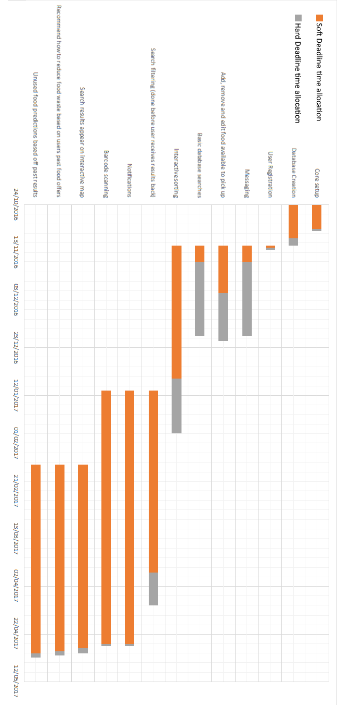

# Contents

- Introduction
- Project Scope
  - Purpose
  - Benefits
  - Project Boundaries
  - Product Vision
  - User Base
- Domain Analysis
  - Background
  - Existing Applications
- Roles
- Risks, Assumptions, Constraints and Dependencies
  - Project Risks
  - Assumptions
  - Dependencies
  - System Constraints
  - Additional Open Issues
- Solution Requirements
  - Function Requirements
  - Non-Functional Requirements
- Development Approach
  - Hardware
  - Software
  - Version Control System
  - Testing Strategy
  - Alternatives
- Definition of Terms and References

# Introduction

Every year in the UK, we throw away 7 million tonnes of food – half of which is perfectly edible. Leveraging such an enormous unused food supply would not only be of great social benefit to those struggling to feed themselves, but also of economic benefit to the typical household. It is estimated that the average family loses £700 a year due directly to food waste. [[1]](http://www.lovefoodhatewaste.com/node/2472)

The main cause of food waste is preparing a larger meal than was needed.  Especially when feeling hungry, having ‘eyes bigger than your stomach’ is a common mistake in the kitchen. The remaining food is quite literally good enough to eat, only lacking someone to do so. People would be quite happy to give their food away, if they could only find someone that would take it.

Our proposed project – Dinno, is a mobile-friendly website focussed on tackling the ongoing issue of food waste in the UK. Through Dinno, users can advertise their unwanted food and with the integrated messaging system, get in touch with likeminded individuals. Users will be able to quickly and comprehensively search for meals or ingredients in their local area and arrange a suitable time for collection.

In much the same way that social networks have made connecting with friends an effortless task, the power of the internet could easily be used to connect people with food to those that need it. Using Dinno, people can quickly see an overview of available donations in the area and if any look particularly appealing, contact the donor to claim their food. What was once only achieved by a few dedicated charities could easily be accomplished by the everyday man with the help of a simple, streamlined website.

# Project scope

## Purpose of Software Project

The purpose of this project is to provide an internet based solution that allows users to give away unwanted food items to others. We aim to achieve this by making the human interaction part of the system as simple as possible without imposing restrictions on how complex the features could be. Because it is an internet-based solution, it can provide affordances that are unique to this type of medium, such as the ability to scale the layout of the program to different devices efficently. Due to the ubiquity of internet browsers, it makes it viable to reach a wide audience.

## Benefits

There are many benefits that this software project will provide, which are not limited to:

- The project will allow users to give away unwanted food items. Food is an abundance and, as mentioned in the introduction a lot of edible food is discarded. Our SaaS (Software as a Service) can help ensure that food can go to people who need it.

- The project will allow users (people above 18 years old) to advertise unwanted food items. Many people find it inconvenient to go out of their way in making sure that their surplus food can be put into good use.

- The project will help spread goodwill among users. Allowing users the opportunity to give away allows them to see first hand where their food is going, which helps in making them feel that they are helping out others.

- Reduce household spending bills. Due to the nature of this software, users will intuitively spend less on groceries.

## Project Boundaries
<!-- read through -->

For the moment we will not be producing a native mobile application from scratch, as our group collectively have little to zero experience in this particular environment, adding to the timespan needed to produced such a program. Additionally, the performance that an application written from scratch will provide as opposed to a web-container style app isn't enough to justify the program to be made.

## Product Vision

We intend the developed application to be used in the following manner listed below. Both characters (Alice and Bob) are used as placeholder names for any of the potential users for the developed solution.

- Alice has food items that she is willing to give away.
- Alice goes onto our web application.
- Alice registers an account, which will allow her to upload listings of their food item.
- Alice goes through the process or adding a listing
	- Alice inputs descriptions and other relevant information about her food item.
	- Alice is given the option to scan the item's barcode, or alternatively she can manually add barcode details to the item.
- Alice's food item is now listed on the web application.

- Another user, Bob, goes onto the web application, with the intention of finding food items to take home.
- Bob searches for an item they like.
- Bob finds Alice's food item listing.
- Bob requests the food item.
- Bob and Alice communiate with each other using the web application's messaging service.
- Both users agree to meet up and transfer food items.
- Both users rate each other's experience after they have met up.

## User Base

Our user base will consist of the following:

- Users short on food
- Users wishing to give away food
- Users wishing to find free food
- Users with an already full supply of groceries.

#Domain Analysis

##Background

There are charities which supply a food sharing experience at events, by catering for events using only spare food. They usually act as a small group of committed individuals who collect the food, prepare it and then give it out whilst collecting some donations. This method means that there is quality control at the charity collection level, meaning that the recipients of the prepared food have a greater confidence in the food. A more peer-to-peer approach to food sharing would get rid of this confidence - this is a problem to tackle.

An example of this method of food sharing is “REfUSE”, a pop up cafe in Durham. They run on a “pay as you feel” basis in order for the cafe to keep running. Another method is having a “community fridge” in which a village has a shop-like place which is stocked and taken from by villagers for free.

In both respects, and any other future respects, there is a system which assists those with excess food and a willingness to support charity to those in need of food. It is key to link these two groups in an effective way.
In regards to security in these systems, there is little. Personal details which are commonly needed such as email addresses and location data need to be protected. Despite no sensitive information being held, security is still a high priority. Other information in the system is on the food which has to be open to all users for it to work successfully.

##Existing Applications

There is a current system in the form of an app called “OLIO - Food Sharing Revolution”. The app seems to have, overall, positive reviews. The one main downside to it is that food is not the only item being advertised on the app. Instead, it is swamped with other non-edible items. This could be solved by having approved items only on the marketplace for users, either by a selected admin or by some automated method.

Accounts can easily be set up either through Facebook or email. It is easy to locate the food and see who has posted it. It also shows how long an item has been posted for and allows for a short description.

We have found it to be quite busy looking with a long list of items sorted by distance to the user. There are no other options for ordering the list or searching - only a “Just Gone” section of the most recently posted food in an almost pointless nation level radius. The main downside is that the system has to be popular to work. Nobody wants to travel very far to get an apple.

# Roles

## Basic Deliverables
| ID | Deliverable         | Assigned to   | Additional Notes |
| --- | ----------------- | ------------ | ----- |
| B1 | Core setup | Thien Nguyen & Joshua Bremner |  Connection to database, defining routes  |
| B2 | Database creation   | Joshua Bremner | |
| B3 | User registration   | John Jennings | Requires database  |
| B4 | Messaging           | John Jennings | Requires database |
| B5 | Add, remove and edit food items  | Thien Nguyen & Robert Shipley | Requires database  |
| B6 | Basic database search  | Simeon Chan    |  Show most relevant results first  |
| B7 | Interactive sorting    | Robert Shipley   | Requires database   |
| B8 | Usability/Accessibility Functions | ? | |

## Intermediate Deliverables

| ID | Deliverable         | Assigned to   | Additional Notes |
| --- | ----------------- | ------------ | ----- |
| I1 | Search filtering | Simeon Chan | Done before user receives results back |
| I2 | Notifications         | Robert Shipley      | For both desktop and mobile versions of website |

## Advanced Deliverables

| ID | Deliverable         | Assigned to   | Additional Notes |
| --- | ----------------- | ------------ | ----- |
| A1 | Barcode scanner | Simeon Chan | Live and still images, available on mobile and on computer via webcam |
| A2 | Interactive map | John Jennings | Display search results in local area |
| A3 | Food waste recommendations | Thien Nguyen    | Recommend how to reduce food waste based on users past food offers |
| A4 | Unused food predictions | Joshua Bremner  | Based on past offers  |

# Risks, Assumptions, Constraints & Dependencies

## Project Risks

**Communication:**

- Breakdown in communication/arguments between team members. Someone should always be keeping track of how people are getting on with each other and their own work.

- Not enough regular communication with the client. There should be check-ups each week showing the client what has been done.

- Time wasted due to waiting for the client's approval on certain features. Make sure that while waiting, team members are occupied with something else i.e. allow for dynamic scheduling.

**Time Management/Scheduling:**

- Not allocating enough time to basic features of the system such as adding tables/input forms. They are simple in design, but can still take some time to implement.

- Not enough time allocated for testing, meaning the eventual program is buggy and unusable.

- Not planning ahead and trying to incorporate too many advanced deliverables in too limited of a time.

- A team member or multiple team members are unable to complete their allocated tasks due to outside personal circumstances or illness.

**Prioritisation**

- Putting focus on advanced deliverables before basic functionality of the system is finished. Basic deliverables should be done first so that if anything is unfinished it will be the advanced tasks, which are less important than basic functionality.

- Lack of focus on the mobile version of the site vs. desktop version. Both are equally important and should be worked on simultaneously.

## System Risks

**Security**

- The final site is hacked e.g. an SQL injection attack leading to release of users' personal information.

- The site is subject to a DDoS attack, leading to users being unable to access the site.

**Reliability/Usability**

- The system goes down regularly due to unreliable hosting or too many concurrent users overloading the server.

- The site is too confusing or difficult for users to learn, leading to them abandoning the system in favour of alternative services.

**Legal/Ethical**

- The site may be subject to legal action if users become ill or receive potentially fatal food poisoning from food which is out of date, or has not been properly labelled in terms of what kind of allergens are contained within it.

- The service may be used for illegal purposes, for example selling food items containing illegal narcotics.

## Assumptions

**Skills:**

- It is assumed that team members allocated to implementation are familiar/will be familiar with web languages such as PHP, HTML, CSS, and Javascript/Node.js

- It is assumed all team members are familiar with basic database design, as well as the implementation of databases using SQL.

**Availability:**

- It is assumed that there will always be a reasonable amount of team members available to work on the system at any point in the project time-frame, excluding holiday time, so that if a team member becomes unavailable for whatever reason then their tasks can be reallocated to another member.

- It is assumed that the client will be available to give feedback at all points in the project time-frame.

**Performance:**

- It is assumed that each team member will have completed all the work allocated to them before each deadline/project checkpoint.

- It is assumed that the client will give accurate and detailed feedback to any parts of the system that they are asked to comment on.

## Dependencies

1. The project requirements need to be fully completed and checked before any design work or implementation is started.

2. The requirements cannot be finalised until feedback and checking have been done by the client (In case any of the requirements are incorrect).

3. Implementation cannot be started on a particular section of the system until all design work has been completed for that section.

4. Testing cannot be completed until all implementation/extra features have been added to the system.

## System Constraints

- Only 3 hours a week have been allocated for group meetings, which must be shared with other projects such as the CEP and LSEPI presentation. This limits the amount of time that can be spent on collaborative design & evaluation.

- Accounts have to be limited to only personal accounts due to the need for face-to-face food collection. Anonymous or ‘guest’ accounts cannot be implemented as this could cause potential security/personal issues.

- Contact between team members as well as direct collaboration will be limited over both the winter and spring holiday periods due to separation as well as varying availability.

## Additional Open Issues

- **What are the exact attributes associated with each food item?**

These can be chosen by the developer depending on what they feel is appropriate.

- **For registration of users, does this feature have to be built into the system, or can it be outsourced via facebook/twitter?**

Preferably built into the system.

- **In general, how important is it that the site’s features are custom-designed vs. being outsourced?**

Generally, as much should be custom-designed from scratch as possible.

# Key
| ID | Deliverable         |
| --- | ----------------- |
| B1 | Core setup          |
| B2 | Database creation   |
| B3 | User registration   |
| B4 | Messaging           |
| B5 | Add, remove and edit food items |
| B6 | Basic database search  |
| B7 | Interactive sorting   |
| B8 | Usability/Accessibility Functions |
| I1 | Search filtering |
| I2 | Notifications          |
| A1 | Barcode Scanning          |
| A2 | Advanced Searching          |
| A3 | Food waste reduction recommendations | 
| A4 | Unused food predictions |
| EX1 | Ranking System |

# Functional Requirements

| Section  | Description |
| ------------- | ------------- |
| ID, type and title  | B3.01 - Account registration  |
| Description  | Form to submit to create an account  |
| Priority  | High  |
| Dependencies  | Database  |
| Expected results  | User will be able to create an account  |
| Exception handling  | User enters incorrect information - reject incorrect information, ask to try again |

| Section  | Description |
| ------------- | ------------- |
| ID, type and title  | B3.02 - Account changes |
| Description  | Form to change details on account e.g. passwords and emails |
| Priority  | Medium |
| Dependencies  | Database  |
| Expected results  | User will be able to modify details on their account |
| Exception handling  | User enters incorrect information - reject incorrect information, ask to try again|

| Section  | Description |
| ------------- | ------------- |
| ID, type and title  | B3.03 - Profile  |
| Description  | Page dedicated to show a users details  |
| Priority  | Medium  |
| Dependencies  | Database  |
| Expected results  | A user's details will be able to be accessed conveniently.  |
| Exception handling  | N/A |

| Section  | Description |
| ------------- | ------------- |
| ID, type and title  | B4.01 - Send message |
| Description  | Send a message via the website from one user to another  |
| Priority  | High  |
| Dependencies  | Database, Socket  |
| Expected results  | Users will be able to communicate through the website  |
| Exception handling  | Invalid recipient/sender (ask user to try again), Invalid message content(ask user to try again), Connection loss(attempt reconnection, if it fails again terminate)|

| Section  | Description |
| ------------- | ------------- |
| ID, type and title  | B4.02 - Message History |
| Description  | Allows user to see previous messages sent to and from another user  |
| Priority  | Medium  |
| Dependencies  | Database |
| Expected results  | More reliable communication between users through the website  |
| Exception handling  | No messages found, Invalid message content, give error message to user if either happens |

| Section  | Description |
| ------------- | ------------- |
| ID, type and title  | B4.03 - Claim Food |
| Description  | Function in chat to agree to collect food. Must be sent through private message|
| Priority  | Medium |
| Dependencies  | Socket, Database  |
| Expected results  | User will be able to claim food but only when both parties agree |
| Exception handling  | Invalid recipient/sender (ask user to try again), Connection loss(attempt reconnection, if it fails again terminate)|

| Section  | Description |
| ------------- | ------------- |
| ID, type and title  | B5.01 - Add single item to available food list |
| Description  | User can add a single item to the database |
| Priority  | High  |
| Dependencies  | Database |
| Expected results  | User will update the database with a single item of food |
| Exception handling | Connection loss with database, make user try again |

| Section  | Description |
| ------------- | ------------- |
| ID, type and title  | B6.01 - Query database  |
| Description  | Sends a query to the database and returns results based on the query|
| Priority  | High |
| Dependencies  | Database  |
| Expected results  | Return a list of foods which fit the query |
| Exception handling  | User inputs a invalid word e.g. any keyword in SQL will be rejected |

| Section  | Description |
| ------------- | ------------- |
| ID, type and title  | B6.02 - Query builder |
| Description  | Function will build a query from parameter given from a user|
| Priority  | High  |
| Dependencies  | N/A |
| Expected results  | Function will return a query in SQL |
| Exception handling  | User inputs a invalid word e.g. any keyword in SQL will be rejected|

| Section  | Description |
| ------------- | ------------- |
| ID, type and title  | B6.03 - View current/past offers  |
| Description  | Allows users to see what they currently offer and what they offered in the past. |
| Priority  | High  |
| Dependencies  | Database  |
| Expected results  | Returns a list of past and current offers  |
| Exception handling  | Connection loss with database, make user try again |

| Section  | Description |
| ------------- | ------------- |
| ID, type and title  | B7.01 - Interactive search sorting  |
| Description  | Allows for user to sort the results without having to reload the webpage |
| Priority  | High  |
| Dependencies  | Database  |
| Expected results  | User will be able to sort things easily by distance, expiry date, alphabetic etc |
| Exception handling  | N/A |

| Section  | Description |
| ------------- | ------------- |
| ID, type and title  | B8.01 - Text/Image Size Adjustment |
| Description  | The ability to adjust size of text & images correcting for those with poor eyesight |
| Priority  | Medium  |
| Dependencies  | All site pages built |
| Expected results  | Text size can be increased or decreased and no errors in formatting/site layout occur |
| Exception handling  | N/A |

| Section  | Description |
| ------------- | ------------- |
| ID, type and title  | B8.02 - Screen Reader Functions/Compatibility |
| Description  | Alternate text for all images/diagrams/maps in the system so that the site can be used with a screen reader. |
| Priority  | Medium  |
| Dependencies  | All site pages built and visual resources added |
| Expected results  | Any image/map in the system should provide alternate text when hovered over. |
| Exception handling  | N/A |

| Section  | Description |
| ------------- | ------------- |
| ID, type and title  | B8.03 - Tutorial/Help Page |
| Description  | A page which runs through how to use the system and contains various FAQs. |
| Priority  | Medium  |
| Dependencies  | All site pages built. |
| Expected results  | Users should be able to load the help page. |
| Exception handling  | N/A |

| Section  | Description |
| ------------- | ------------- |
| ID, type and title  | I1.01 - Intermediate search functionality  |
| Description  | Filtering on the search results based on location, radius, item type etc |
| Priority  | Medium  |
| Dependencies  | Database |
| Expected results  | Server will provide a list of foods available, presorted based on location, radius, or item type etc  |
| Exception handling  | Connection loss with database, make user try again |

| Section  | Description |
| ------------- | ------------- |
| ID, type and title  | I2.01 - Notifications  |
| Description  | Users receive a notification when food they are looking for becomes available |
| Priority  | Medium  |
| Dependencies  | Database  |
| Expected results  | Users will receive a notification when food is available either by an email, or by mobile push notifications |
| Exception handling  | N/A |

| Section  | Description |
| ------------- | ------------- |
| ID, type and title  | A1.01 - Still images  |
| Description  | Users will be able to scan in a still image taken by a mobile device or webcam for desktop version of website. |
| Priority  | Low  |
| Dependencies  | Database, QuaggaJS, Global barcode database |
| Expected results  | Barcode will be detected, decoded and passed onto global database to look up number and find name of item|
| Exception handling  | Incorrect barcode decoded, make the user confirm this is the item they want to add |

| Section  | Description |
| ------------- | ------------- |
| ID, type and title  | A1.02 - Live images  |
| Description  | Users will be able to use their cameras to produce a live image taken by a mobile device or webcam for desktop version of website. |
| Priority  | Low  |
| Dependencies  | Database, QuaggaJS, Global barcode database |
| Expected results  | Barcode will be detected, decoded and passed onto global database to look up number and find name of item|
| Exception handling  | Incorrect barcode decoded, make the user confirm this is the item they want to add |

| Section  | Description |
| ------------- | ------------- |
| ID, type and title  | A2.01 - Interactive map  |
| Description  | Map will display locations of food, which when clicked displays more information about the available food there. |
| Priority  | Low  |
| Dependencies  | Database, Google maps api |
| Expected results  | After searching, map will show locations of food searched for by the user, if user chooses to click the markers, information regarding the food available there will be shown |
| Exception handling  | N/A |

| Section  | Description |
| ------------- | ------------- |
| ID, type and title  | A3.01 - Food waste reduction recommendations  |
| Description  | System to analyse users food waste and provide recommendations on how to reduce food waste |
| Priority  | Low  |
| Dependencies  | Database |
| Expected results  | System will recommend to users how to reduce food |
| Exception handling  | N/A |

| Section  | Description |
| ------------- | ------------- |
| ID, type and title  | A4.01 - Unused food recommendation |
| Description  | System to analyse users food waste and provide recommendations on what foods users should give away |
| Priority  | Low  |
| Dependencies  | Database |
| Expected results  | System will recommend to users which foods they should give away from past it has been uploaded to the site. |
| Exception handling  | N/A |

| Section  | Description |
| ------------- | ------------- |
| ID, type and title  | EX1.01 - Rating System  |
| Description  | Allows users to rate others in order to simulate a trust system. This will be based on if users put down what they are actually giving away e.g. if a user says they are giving away bread and they give away something other than bread then they will receive a lower rank. It will also be based on the condition of the food that a user picks up. Users who give out of date food will receive lower ratings from other users.|
| Priority  | Low  |
| Dependencies  | Database  |
| Expected results  | Users will be able to rate others.  |
| Exception handling  | User doesn't rate, Rating higher or under a range. reject users input and try again |

| Section  | Description |
| ------------- | ------------- |
| ID, type and title  | EX1.02 - Report food |
| Description  | Function will allow users to report food which doesn't match description |
| Priority  | Low  |
| Dependencies  | Database |
| Expected results  | Will notify admins, and will be marked as reported food, the user who reported the food will receive a rating on accuracy|
| Exception handling  | Connection loss with database, make user try again |

# Non-Functional Requirements

## Security/Access Requirements

| Requirement Type | Description |
|------------------|-------------|
|Security|User accounts should be secured with passwords and personal data being hashed/encrypted and stored in a secure database.|
|Security|The system should prevent against common SQL injection or brute-force attacks on login pages|
|Security|The site should be able to resist at least 90% of potential DDoS attacks.|
|Security|The failure rate for password authentication on login pages should not exceed 0.005%.|
|Security|The system should provide logs on all visitor requests to the site in order to monitor potentially malicious behaviour.|
|Access|The admin login section of the site should have authentication in place to restrict access from malicious users.|

## Performance

| Requirement Type | Description |
|------------------|-------------|
|Reliability|The system should store backups of all customer and admin data which can be loaded as needed so as to ensure the website can still run if the database is corrupted.|
|Reliability|The system should be able to detect potential errors and provide warnings to users/admins.|
|Efficiency|Searches should take no more than 4 seconds for at least 95% of users.|
|Responsiveness|Response time on mobile should match or at least be no more than a second greater than on desktop for 95% of users.|
|Responsiveness|It should be the case that for normal users the response time for loading new pages should not exceed 4 seconds for at least 95% of pages.|
|Responsiveness|Private messages sent between users should be received within 1 second for at least 95% of users.|
|Responsiveness|The system should have animation/feedback on all input buttons/links to indicate to a user that the site is responding to mouse input correctly.|
|Scalability|Ensure the site has a modular design to ensure that any extra site features/pages can be implemented when needed.|
|Scalability|New database tables/records should be able to be added easily using site admin tools.|
|Robustness|The site should be able to cope with a sudden influx of requests (eg. on login page) without going down.|
|Robustness|The site should be able to deal with invalid login details by performing validation and giving appropriate error messages.|
|Robustness|There should be limits on what size image files should be uploaded to the system to prevent excessively large files being uploaded which slow down the system.|
|Robustness|The system should be maintained so as to account for changes which could potentially lead to errors, such as dead links or updates to implemented APIs.|

## Usability/Ease of Access

| Requirement Type | Description |
|------------------|-------------|
|Usability|At least 80% of users shall rate the system as easy to use.|
|Usability|The site should have a navigation system that is easy to understand as according to at least 80% of users.|
|Usability|Any error messages given to the user for things such as incorrect input should be as specific and clear as possible so as to prevent confusion as to what has occurred, and should provide a possible solution depending on the error|
|Accessibility|The system should have colour schemes which do not cause problems for people with colour blindness.|
|Accessibility|The system should be accessible on all major desktop & mobile internet browsers (Chrome, Safari, IE, Firefox)|
|Accessibility|The site should adjust the size and position of content appropriately depending on the screen size of the user.|

## Maintainability

| Requirement Type | Description |
|------------------|-------------|
|Maintainability|All the site code should be well commented and documented.|
|Maintainability|The code should have low complexity with average method length not exceeding 100 lines.|
|Maintainability|The site should use modular, organised architectures which are easily modifiable and maintainable.|
|Maintainability|Installation or removal of site features should leave all database contents and all personal settings unchanged.|

# Development Approach

## Hardware
In terms of hardware, our program will be running on a server that is:

- capable of having a dedicated connection to the internet
- capable of handling potentially a large amount concurrent users
- have no ports blocked
- running on an operating system that allows us to have full reign of the installation of software.
- allows storage.

This hardware can be either virtually connected using a service provider such as Amazon's EC2, or owned physically, but at either case they will be provided by the client.

The program will be accessed on any device with web browser support.

## Software
In terms of software we will be using Node.JS as our preference of backend languages, as this allows us to be expendable in terms of programming potentially useful features, such as engineering mobile apps.

We'll be using a variety of Node.JS packages that will assist with the features we wish to implement, which are not restricted to:

    "body-parser": "^1.16.0",
    "bower": "^1.8.0",
    "express": "^4.14.0",
    "mysql": "^2.13.0",
    "pug": "^2.0.0-beta6",
    "socket.io": "^1.7.2"

Our team will have their own preference of text editors and IDE's.

Live testing will be performed on modern web browsers (which include HTML5 Support) and the program must be able to run on at least IE 11+.

## Version Control System
Our choice of a version control system is Git, where a private repository is set up on GitHub. This allows us to collaborate with ease and allows us to see who is responsible for certain sections of code on the system. This also helps with publishing the product source code online in order to fulfill the open source aspect of our mission.

## Testing Strategy
In terms of Testing Strategy we have chosen to adopt the dynamic testing approach, which will allow us to rapidly adapt and test weaknesses in the program. White Box Testing will be the chosen method of choice; alongside testing on the fly.

## Alternatives
Alternatives to this would include the LAMP stack (Linux, Apache, MySQL, PHP). This set would be convenient to novice programmers but:

- this set is limited in its functionality.
- features that we wish to implement would be laborious and cumbersome to program in this stack. (Push Notification, Mobile Application Implementations)
- Data will not be able to be pushed on the fly without potentially harming the integrity of the program, or manipulate the data in such a way that causes problems with unnecessarily causing performance issues on the server.

Another possible implementation is revolved around Java web development. While this may be very robust to program in, this choice is however much slower to implement and require a lot of resources to run. It is also very difficult to find a host that will accept Java applications, which leads to the case that nearly all Java web programs are hosted on dedicated servers.

# Definition of Terms and References

| Term  | Definition |
| ------------- | ------------- |
| Amazon EC2 | Amazon Elastic Compute Cloud, is a Amazon web service which allows a scaleable cloud for computing/processing information |
| Application Programming Interface (API) | A set of functions and procedures that aid the utalisation of a operation system's functionality. |
| Architecture | The style and design of the way something is built or composed. |
| Brute Force Attack | A repeated trial-and-error attack to gain unauthorised access. |
| Cloud | An external service to process or store data outside the system. |
| Data Corruption | When information becomes incorrect or unusable due to errors. |
| Database | A collection of data, usually kept and accessed via some database management software. |
| Encryption | A method of converting information into code, in order to prevent unauthorised use. |
| Implementation | The existing, working system made from the designs. |
| Intuitive | To be able to be used instinctively or to be easy to use. |
| JavaScript | A web based programming language. |
| Node.JS | An open-source, cross-platform JavaScript runtime environment. |
| Operating System | Software to make the hardware of a computer usable. |
| Parameter | A variable passed into a function. |
| Port | A point of communication to and from an operating system. |
| Query | SQL sentence sent to a database to retrieve certain information OR synonymous with question. |
| QuaggaJS | Module for Node.JS to allow for barcode scanning |
| Responsive Design | A design such that the user will get feedback from it during use. |
| Route | A specific website link which provides access to different parts of th site e.g. search and chat  |
| Runtime Environment | Implements the core behaviour of a computer language. |
| SaaS | Software as a Service.  |
| Socket | A tool that allows for connections to be created between machines.  |
| Validation | Processing to ensure the restrictions on data are maintained. |

## References 
 
 1 - [http://www.lovefoodhatewaste.com/node/2472](http://www.lovefoodhatewaste.com/node/2472) 

